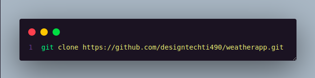
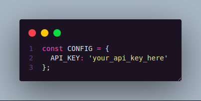

# WeatherApp


WeatherApp is a sleek and user-friendly web application that provides real-time weather information. With its intuitive interface and responsive design, users can easily check current weather conditions and hourly forecasts for any location.

## Features

- **Real-time Weather Data**: Get up-to-date weather information for any city.
- **Hourly Forecast**: View weather predictions for the next several hours.
- **Geolocation**: Quickly fetch weather data for your current location.
- **Responsive Design**: Enjoy a seamless experience across all devices.

## Technologies Used

&nbsp;
&nbsp;
&nbsp;

## Getting Started

To run WeatherApp locally:

1. Clone this repository:



2. Navigate to the project directory:

```bash
cd weatherapp
```

3. Open the `index.html` file in your preferred web browser. If you want, install a live server (or live preview) extension in your code editor to serve the project.

## API Key

This project uses the OpenWeatherMap API. To use your own API key:

1. Sign up for an account on [OpenWeatherMap](https://openweathermap.org/) to get an API key.
2. Replace the placeholder API key in the JavaScript file with your own API key:



## Contributing

Contributions are welcome! If you'd like to contribute to WeatherApp, please fell free to fork the repository and submit a pull request.

## License

This project is licensed under the MIT License.
